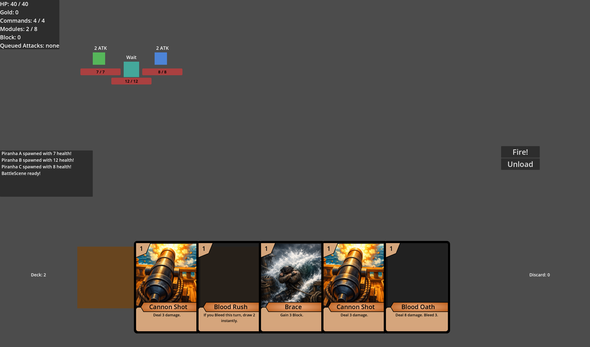
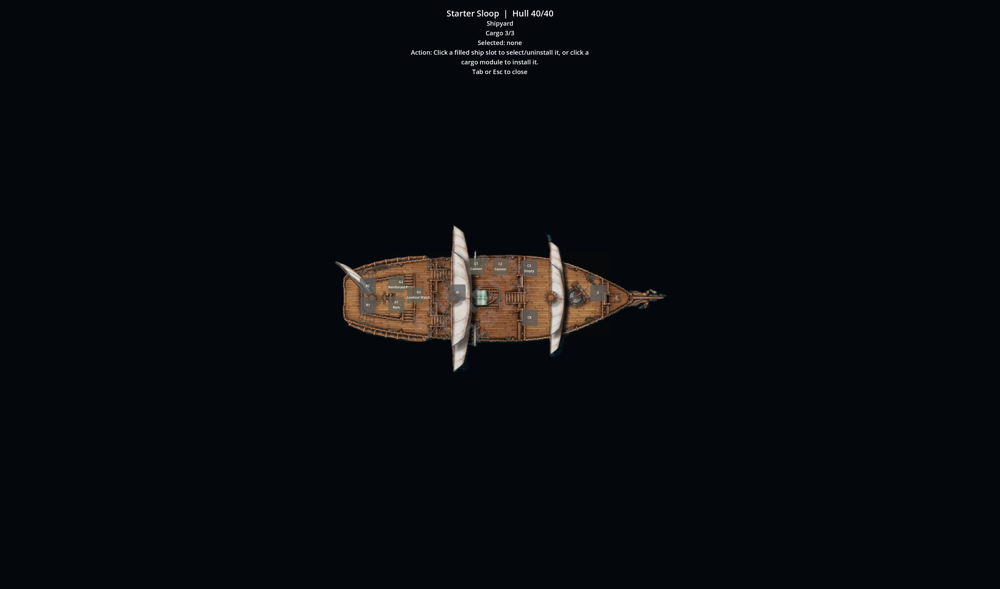

# Waveport

Waveport is a Godot 4 prototype that mixes deckbuilding, ship modules, and turn-based pirate combat. The core loop is built around loading cannon cards into a firing queue, timing instant cards around enemy intents, and tuning your ship between encounters with module swaps and cargo rewards.

## Project Status

Waveport is a prototype and portfolio snapshot, not a finished commercial release.

- One playable captain is enabled today; the additional captain slots are placeholders.
- One starter ship is implemented, with module slots, cargo, and a ship preview/loadout overlay.
- The main run currently covers a short four-encounter sequence, plus drills/tutorial battles and a sandbox encounter selector.
- Systems work is further along than content, balance, UX polish, audio, and final presentation.
- The build still contains test-friendly scaffolding, including drills, sandbox fights, and debug-oriented starter cargo.

## Screenshots

Combat prototype with multi-enemy encounters, card hand management, queued attacks, and enemy intent previews.

Ship preview/loadout screen used to inspect slot types, installed modules, and cargo capacity.

## Technical Highlights

### Card Queue System

- Cards are defined in `data/CardList.gd` and instantiated through `globals/DeckManager.gd`.
- Queueable cards are converted into lightweight queue data and stored in `globals/TurnManager.gd`.
- `globals/CombatMath.gd` previews queue outcomes before firing, including order-sensitive bonuses, next-shot multipliers, repeated shots, and cannon/module bonuses.
- After firing, `DeckManager` resolves discard/redraw flow and keeps the hand, deck, and discard UI in sync.

### Enemy Intent System

- Enemy behavior is data-driven through `data/EnemyList.gd` instead of being hardcoded per encounter scene.
- Enemies can use fixed patterns, weighted action tables, slot-specific side behaviors, conditional actions, and scripted follow-ups through `globals/EnemyActions.gd`.
- Intent text is generated from the selected action and surfaced in battle so the player can plan around attacks, defense turns, buffs, and formation shifts.

### Modules And Ship Loadout

- Ship slots are described in `data/ShipList.gd`, while module definitions live in `data/ModuleList.gd`.
- `globals/PlayerData.gd` recalculates command bonuses, hull bonuses, hand size, queue size, and module-granted cards from the installed loadout.
- `scenes/ShipPreview.gd` provides an inspect/manage overlay for swapping modules between active slots and cargo outside combat.

### Turn Flow

- `scenes/BattleScene.gd` orchestrates the combat loop: start turn, queue or unload cards, fire the queue, resolve enemy actions, rotate formations, then begin the next turn.
- `globals/TurnManager.gd` owns commands, queued actions, and temporary turn modifiers.
- `globals/TurnEffects.gd` handles instant-card side effects such as bleed, burn, draw, healing, delayed block, and repeat-fire effects.
- The run layer already includes intermission/plunder flow, guided drills, and a sandbox arena for focused encounter testing.

## Getting Started

### Requirements

- Godot 4.4 or newer is recommended.
- No external addons or third-party dependencies are required.

### Open And Run

1. Clone or download this repository.
2. Open Godot 4 and import the folder that contains `project.godot`.
3. Let Godot finish its first asset reimport pass.
4. Press `F5` in the editor or use **Run Project**.

The project currently starts at `scenes/MainMenu.tscn`.

### Notes

- Save data is written at runtime to `user://save_slot_1.json` by `globals/SaveManager.gd`.
- If you pull renamed assets or scene changes, reopen the project once so Godot can refresh imports.
- This repo intentionally ignores `.godot/` and other local/generated editor artifacts.

## Controls

- Mouse: play cards, queue attacks, and navigate menus
- Fire button: resolve the queued attacks
- Unload button: empty the current queue and refund commands
- `Tab`: open or close the ship preview overlay during battle
- `Esc`: close the ship preview; in sandbox mode it returns to the sandbox menu
- `R`: restart the current sandbox encounter

## Repository Layout

- `assets/` runtime art used by the game
- `cards/` card scene and card behavior
- `data/` card, enemy, ship, module, and run definitions
- `enemies/` enemy scenes and base enemy behavior
- `globals/` autoload managers and combat systems
- `modules/` experimental module scene stubs
- `scenes/` menus, battle flow, plunder/intermission, drills, and sandbox
- `ship/` player ship scenes/scripts
- `ui/` reusable combat UI scenes
- `media/` GitHub-facing screenshots and capture assets
- `docs/` repo audit notes for the public release pass

## Media

Additional GitHub screenshots or short GIFs can go in `media/screenshots/`. Runtime game assets should stay in `assets/`.
