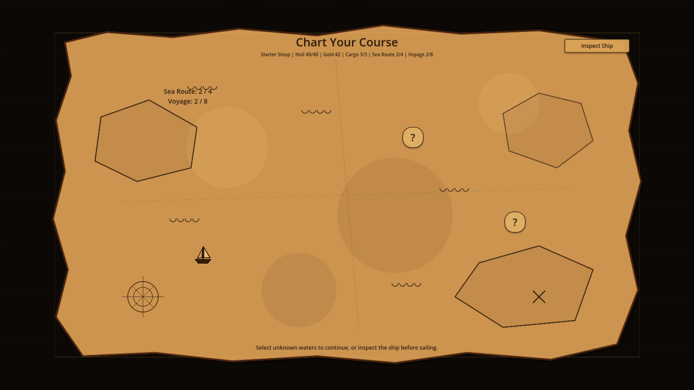

# Waveport

Waveport is a Godot 4 deckbuilding tactics prototype about sailing a modular ship through escalating sea and pirate encounters. The project combines card-driven combat, cannon queue planning, enemy intent readability, ship loadout management, and a stylized voyage map that frames run progression as charting a course across unknown waters.

This repository is a portfolio snapshot focused on systems design, readable gameplay architecture, and UI iteration. It is not a finished commercial release.

## Project Highlights

- **Pirate-map voyage flow:** The intermission screen presents the run as a parchment treasure map with unknown destination markers, dotted ink routes, ship movement, and randomized route animations including wavy, zigzag, loopy, and staircase paths.
- **Eight-battle run structure:** Runs progress through sea encounters, a sea boss, pirate encounters, and a pirate boss while preserving a clear battle-to-battle flow.
- **Cannon queue combat:** Cannon cards load into a two-cannon firing queue, letting players plan attack order, previews, unloads, and turn timing around enemy intents.
- **Modular ship management:** The ship preview/loadout overlay supports installed modules, cargo modules, slot types, and between-battle inspection.
- **Data-driven enemies:** Enemy behavior is defined through reusable data tables for fixed patterns, weighted actions, conditional behavior, formation shifts, and pirate-specific encounters.
- **Testing tools:** Guided drills and a sandbox enemy selector make it easy to test combat rules, enemy behavior, and edge cases quickly.

## Screenshots

Voyage map intermission showing parchment presentation, unknown route markers, and ship course plotting.

Combat prototype with card hand management, cannon loading, queued attack previews, and enemy intent display.

Ship preview/loadout screen used to inspect active slots, installed modules, and cargo capacity.

## Technical Highlights

### Voyage And Run Flow

- `data/EnemyRunConfig.gd` builds the current eight-battle run order and annotates encounters with route progress metadata.
- `scenes/IntermissionScreen.gd` owns the pirate-map presentation, route selection, ship animation, selected-marker ink effects, and fade into battle.
- The map remains presentation-only for now: both unknown markers lead into the existing next-battle progression without adding branching, shops, treasure, or new event systems.

### Card Queue Combat

- Cards are defined in `data/CardList.gd` and instantiated through `globals/DeckManager.gd`.
- Queueable cannon cards are converted into lightweight queue data and managed by `globals/TurnManager.gd`.
- `globals/CombatMath.gd` previews queue outcomes before firing, including order-sensitive bonuses, next-shot multipliers, repeated shots, and module-based cannon bonuses.
- The current combat UI limits active cannon loading to two cannon slots, keeping the queue readable and deliberate.

### Enemy Intent System

- Enemy behavior is data-driven through `data/EnemyList.gd` instead of being hardcoded per encounter scene.
- Enemies can use fixed patterns, weighted action tables, slot-specific side behaviors, conditional actions, and scripted follow-ups through `globals/EnemyActions.gd`.
- Intent text is generated from the selected action and surfaced in battle so the player can plan around attacks, defense turns, buffs, summons, and formation shifts.

### Modules And Ship Loadout

- Ship slots are described in `data/ShipList.gd`, while module definitions live in `data/ModuleList.gd`.
- `globals/PlayerData.gd` recalculates command bonuses, hull bonuses, hand size, queue size, and module-granted cards from the installed loadout.
- `scenes/ShipPreview.gd` provides an inspect/manage overlay for swapping modules between active slots and cargo outside combat.

### Battle Presentation

- `scenes/BattleScene.gd` orchestrates the combat loop: start turn, queue or unload cards, fire the queue, resolve enemy actions, rotate formations, then begin the next turn.
- Battle entry now supports a cleaner fade sequence so the map fades out, battle fades in, and enemies appear after the battle screen has loaded.
- `ui/CannonLoadSlots.gd` and `ui/CannonLoadSlot.gd` handle cannon placement visuals, loaded-card drag behavior, and damage previews.

## What This Demonstrates

- Building gameplay systems with clear ownership boundaries across data, global managers, scenes, and reusable UI.
- Iterating on game feel through small, testable presentation passes instead of rewriting core progression.
- Keeping prototype tools available through drills and sandbox fights while preserving the main run flow.
- Translating player-facing feedback into scoped engineering changes: route timing, motion readability, enemy fade sequencing, and combat UI clarity.

## Getting Started

### Requirements

- Godot 4.4 or newer is recommended.
- No external addons or third-party dependencies are required.

### Open And Run

1. Clone or download this repository.
2. Open Godot 4 and import the folder that contains `project.godot`.
3. Let Godot finish its first asset reimport pass.
4. Press `F5` in the editor or use **Run Project**.

The project currently starts at `scenes/MainMenu.tscn`.

### Notes

- Save data is written at runtime to `user://save_slot_1.json` by `globals/SaveManager.gd`.
- If you pull renamed assets or scene changes, reopen the project once so Godot can refresh imports.
- This repo intentionally ignores `.godot/` and other local/generated editor artifacts.

## Controls

- Mouse: play cards, queue attacks, inspect ship slots, and navigate menus
- Fire button: resolve the queued cannon attacks
- Unload button: empty the current queue and refund commands
- `Tab`: open or close the ship preview overlay during battle or voyage intermission
- `Esc`: close the ship preview; in sandbox mode it returns to the sandbox menu
- `R`: restart the current sandbox encounter
- `+` / `-`: cycle sandbox enemies while testing

## Repository Layout

- `assets/` runtime art used by the game
- `cards/` card scene and card behavior
- `data/` card, enemy, ship, module, and run definitions
- `enemies/` enemy scenes and base enemy behavior
- `globals/` autoload managers and combat systems
- `modules/` experimental module scene stubs
- `scenes/` menus, battle flow, plunder/intermission, drills, and sandbox
- `ship/` player ship scenes/scripts
- `ui/` reusable combat UI scenes
- `media/` GitHub-facing screenshots and capture assets
- `docs/` repo audit notes for the public release pass
